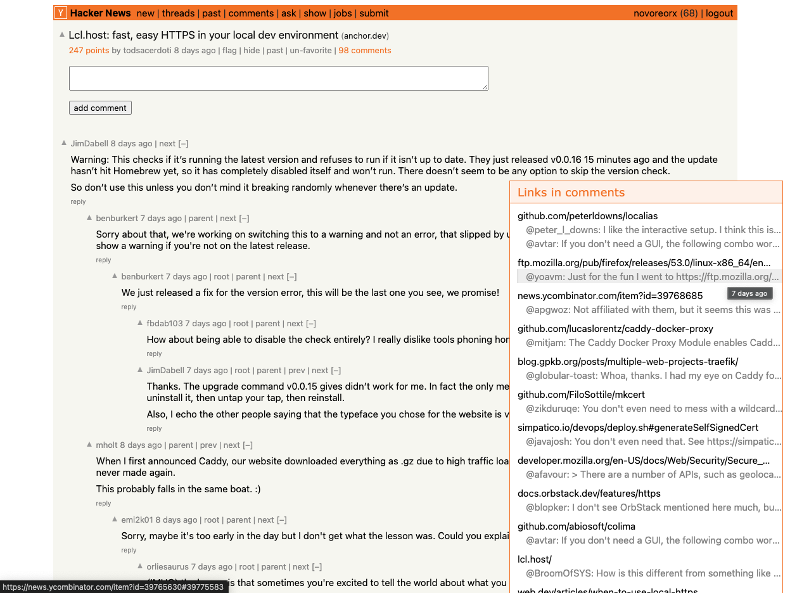

This repository is for storing my user scripts that cater to my specific needs. If you find them useful, you can install them by copying them to your own user script extension.

## HN Tweak

This script primarily performs two functions:
1. It modifies the style of the Hacker News thread page to improve readability, while maintaining the original design as much as possible.
2. It collects links from comments and displays them in a panel at the bottom right of the page. These links are sorted by mention count. You can click on the comment brief to navigate to the particular comment, and toggle the panel by clicking on the title.

