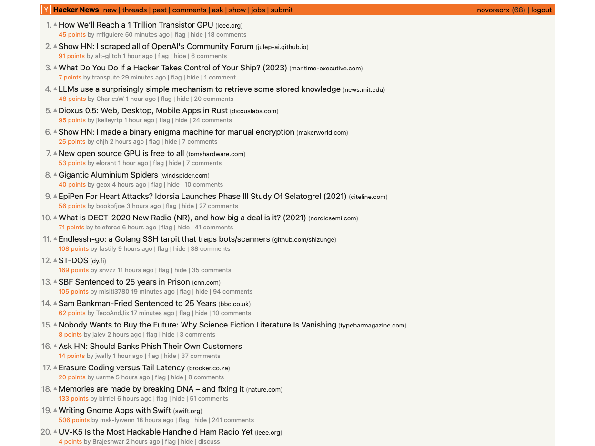

This repository is for storing some userscripts that cater to my specific needs. If you find them useful, feel free to install them by copying them into your own user script extension. I recommend using [Violentmonkey](https://violentmonkey.github.io/) if you don't already have a user script extension installed.

## HN Tweak

This script primarily performs two functions:
1. It modifies the style of the Hacker News item page to improve readability, while maintaining the original design as much as possible.
2. It collects links from comments and displays them in a panel at the bottom right of the page. These links are sorted by mention count. You can click on the comment brief to navigate to the particular comment, and toggle the panel by clicking on the title.

Item page:

Home page:

## GitHub TOC Sidebar

I have a Chrome extension called [GitHub TOC Sidebar](https://github.com/reorx/github-toc-sidebar) that generates a table of contents for a repo's README. It's primarily a content script, so it can be conveniently ported to a userscript. I will do so if there is a demand for it.

